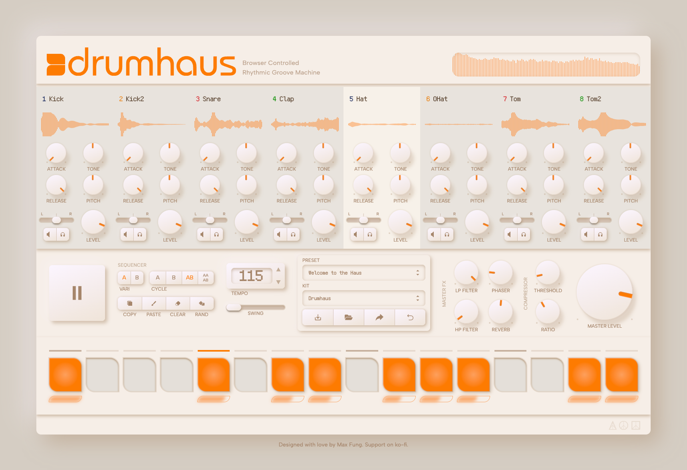

# Drumhaus



[See it live at drumha.us](https://www.drumha.us/)

Drumhaus is a browser controlled rhythmic groove machine built with Tone.js and next. Explore web based drum sampling with limitless creativity, and share it all with your friends.

I'm an amateur music producer, and have always been fascinated by the music software I use in my creative process. I wanted to build this project as a way to combine my love for music with my passion for coding, and dive deep into digial audio engineering and web development. I wanted to reimagine the form of a classic drum machine in a web browser with modern software technologies.

Drumhaus contains a curated assortment of sample kits and presets to help you craft the perfect groove. Its sequencer allows you to program two variations of 16th note loops on eight instruments. It was designed to be compact, open-source, and free to use for anyone interested in music production.

## Tools/Libraries Overview

Here's a brief list of the notable dependencies used in this project:

### tone.js

Early on in my design, I hit a roadblock while trying to produce a high-performance audio event scheduling algorithm for my sequencer using the barebones Web Audio API. Soon after, I discovered Tone.js, a Web Audio framework with high-performance building blocks to create complex music software in JavaScript. We don't always need to re-invent the wheel during development, and Tone.js empowered this project with its wrapping, synchronization, and scheduling capabilities.

### next.js

This framework has fueled my love for web development using React, and I wanted to include it for its serverless functioning, file based routing, hot module replacement, and overall developer experience.
 
### chakra-ui

Used for its wide array of components, styling, and themeing capabilities. The majority of this project's React components were built with and styled by Chakra UI's library.

### postgres

This project uses postgres db for storing preset information that can be shared by users with a dynamically generated link.

### librosa

Worth mentioning here, the amplitude datasets used to generate frequency response waveforms for each sample are cached on the server using Python with librosa.

## Features

### Kits

Kits are curated groups of samples available in Drumhaus that can be swapped as a group on the fly, allowing more flexibility to find the perfect sound for your production. The samples returned by kits are served from Next.js, and are cached locally for reuse after the initial fetch.

### Presets

Drumhaus comes pre-loaded with presets to inspire users with its wide variety of sounds and musical capabilities. Presets encapsulate the state of the application and can be used to save and share music. Users can also create their own custom presets which can be saved and loaded from local .json files, written as (.dh). Presets can be shared via a custom generated link, and are stored in a postgres db.

### Sequencer

The sequencer is capable of programming 2 variations of 16th note loops per sample. Variations can be chained in four different sequences: A, B, AB, and AAAB. This allows users to craft more dynamic loops based on their needs. Each note has a customizable velocity value, allowing users to increase or decrease its loudness. Variations can be copied, pasted, cleared, and randomized across all samples using the sequencer controls. For usability, users can click and drag to program multiple notes in one motion, and click and drag to set velocity values in the user interface.

### Sample Processing

Each individual sample can be processed with an ASDR envelope, low pass filter, and high pass filter, and mixed with panning and volume controls.

### Master Processing

The master audio output has a low pass filter, high pass filter, phaser, reverb, and compressor, each with their own control parameters.

### Input Knobs

While I chose not to reinvent the wheel when it came to low-level audio processing with TypeScript/JavaScript, I did reinvent the wheel with these knobs (literally and figuratively). These took an immense amount of time and research to perfect, but are, in my humble opinion, leagues better than the majority of knobs I found available in open source. The knobs utilize framer motion to transform cursor position into rotational values on screen, and they also transform the cursor position into custom audio parameters. There are a variety of novel outputs these knobs can produce, including logarithmic responses for frequency ranges dealing with Hz values, and split inputs where one half of the knob's rotational range can map to a different output than the other half.

### Audio Visualization

Each sample has associated frequency response data that is graphed as a graphic in the user interface when the sample is displayed. Audio data was generated using librosa, is stored on the server, and can be cached locally for re-interpretation.

## Features Not Yet Added

As of the most recent update to this README, Drumhaus is currently at its minimum viable product iteration. I have an exciting plan for additional updates which should increase its usability, reach, and power in the future.

- Some form of tutorial, written or interactive, that recognizes users
- Amplitude monitors on the instrument slots and compressor threshold
- Cache the user's state in the browser so it persists between sessions
- Add C and D variations, as well as AABB and ABBB chains

Some other fun ideas I have in mind and will implement if I get the time:

- Create an additional 8 slots for non-drum samples, like intrument hits and other one-shots
- Include loops, which will be BPM aware and can be manipulated based on the project tempo
- OAuth for users to view a list of their shared kits
- Custom kits that allow users to drag and drop their own audio files in and save them
- A social media style feed where users can find and share custom kits and presets, with OAuth

## Running Locally

Once cloned, in the project directory, install all the node modules with npm:

```
npm install
```

Then, simply run:

```
npm run dev
```

This project uses a postgres database hosted on Vercel with Neon. You will have to make modifications to this project's code to either ignore database calls or spin up your own local db.

## Generating Waveform Data

If you'd like to generate new sound data for the sample library, you should spin up a `venv` first. Once you've activated your venv, you can install the necessary Python packages from `requirements.txt`:

```
pip install -r requirements.txt
```

After that, you can run:

```
python3 src/lib/audio_to_json.py
```

## Quickly creating new kits

There is a Python script that supports quickly (sort-of) adding new kits to your local instance of Drumhaus.

Create a new folder with any unique name, and add 8 samples in .WAV format to `public/samples/your_folder/`.

Run the script:

```
python3 src/lib/new_kit.py
```

Enter the desired name for your kit when prompted and let the script run.

You will need to reference `src/lib/kits.ts` to review your auto-generated data and ensure it has been added correctly.

Finally, append it to the state array of kit options (`kitOptions`) in `src/components/controls/PresetControl.tsx`.

Presets are managed within their own files in `src/lib/presets/`. You can create a new preset by importing .json data exported from Drumhaus' client as a .dh file. The approach is close to adding kits, and is probably not worth mentioning here.