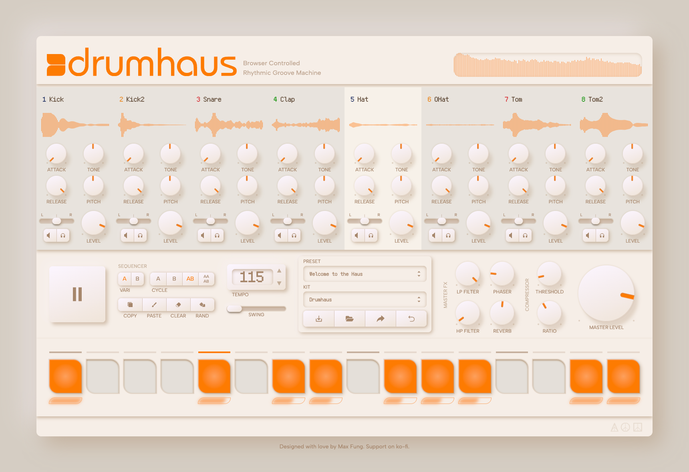

  

<h3 align="center">
  A drum machine for the browser.
</h3>

  <a href="https://drumha.us"><strong>Play at drumha.us</strong></a>

  

Drumhaus is a drum machine for the browser. It's sample-based, performant, and built with a powerful sequencer for sketching ideas quickly and performing full patterns live. Inspired by classic Roland hardware and the Bauhaus school, it was designed to feel more like a physical product than software. Share beats as compressed URLs, export to WAV, or install it as an offline PWA.

## Features

**Sequencer**

- 8 voices, 16 steps, four chainable A/B/C/D variations up to 8 bars
- Per-step velocity, flam, ratchet, and accent controls
- Per-voice timing nudge for humanized grooves
- Click-drag step entry, copy/paste/clear per voice or variation

**Sound**

- Per-voice decay envelope, HP/LP filters, pan, volume, semitone pitch, mute/solo
- Master bus: HP/LP filters, saturation, phaser, reverb, compressor
- 10 curated sample kits with instant hot-swap

**Workflow**

- Presets: save locally, export as `.dh` files, or share as compressed URLs
- WAV export via offline rendering with configurable bar length and FX tail
- Keyboard shortcuts, responsive layout scaling, night mode

## Technical highlights

The audio engine is built on [Tone.js](https://tonejs.github.io/) with a custom sequencing layer that precomputes patterns on every update, keeping playback tight and timing-consistent between live and offline rendering. Preset sharing uses a custom serialization pipeline with bit-packing, [pako](https://github.com/nodeca/pako) compression, and base64url encoding to compress full rig snapshots into ~200 character URL parameters. A centralized animation clock synchronizes all visual feedback (step indicators, gain meters, frequency analysis, intro lightshow) to a shared frame timeline, bypassing React renders in favor of direct DOM writes via data attributes.

## Writing

- [A Drum Machine for the Browser](https://maxfu.ng/writing/a-drum-machine-for-the-browser) — the original build
- [Announcing Drumhaus v1](https://maxfu.ng/writing/announcing-drumhaus-v1) — the rewrite

## License

© 2023-present [Max Fung](https://maxfu.ng). Licensed under [CC BY-NC-SA 4.0](./LICENSE.md).

If this project brings you joy, consider [buying me a coffee](https://ko-fi.com/maxfung).
