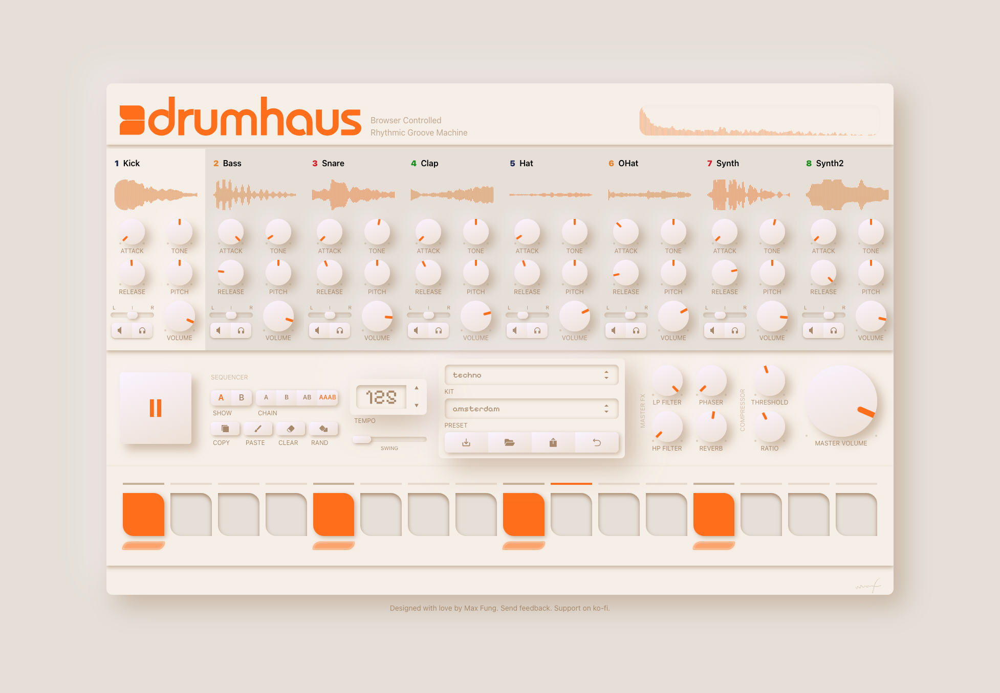

# Drumhaus

Drumhaus is a browser-based drum machine and sampler inspired by classic analog hardware. It was designed to have simple controls, tight timing, and a workflow that feels like hands-on gear. It loads instantly, works offline, and provides a clean, minimal interface for building beats.

At its core is a step-sequencer with 8 voices, 16 steps, per-step velocity, A/B pattern variations, per-instrument parameters, and a master output chain.

Everything runs client-side using Tone.js and a small set of React components.

**[Try it live at drumha.us](https://drumha.us)**

## Features

### Kits

10 curated drum kits with 8 instruments each. Kits can be swapped on the fly to find the perfect sound for your production. Samples are served as static assets and cached locally after the first load.

### Presets

Save and load complete snapshots of your patterns, kit selection, effects, and BPM. Presets can be downloaded as `.dh` files, loaded from local files, and shared via URLs powered by custom compression, bit-packing, and data encoding.

### Sequencer

Program 2 variations (A/B) of 16th note loops per instrument. Chain variations in four modes: A, B, AB, and AAAB for dynamic arrangements.

- Per-step velocity control
- Click and drag to program multiple steps
- Copy, paste, clear, and randomize operations
- Real-time step indicator during playback

### Sample Processing

Per-instrument controls:

- ADSR envelope (attack/release)
- High-pass and low-pass filters
- Pan and volume
- Pitch transposition (semitones)

### Master Processing

Master chain effects:

- High-pass and low-pass filters
- Phaser
- Reverb
- Compressor (threshold and ratio)
- Master volume

### Transport

- BPM control
- Swing parameter for humanization
- Spacebar to play/pause

### Custom Knobs

Custom, hand-crafted rotary controls built with Framer Motion. Features include logarithmic responses for frequency parameters and split inputs where each half of the rotation maps to different output ranges. These took an immense amount of time and research to perfect, but are, in my humble opinion, one of the greatest outcomes of the project.

### Audio Visualization

Real-time frequency analyzer and per-sample waveform displays. Frequency response data is pre-generated using librosa and served as static JSON (soon to be changed ;).

## License

This project is licensed under the Creative Commons Attribution-NonCommercial 4.0 International License.
See the [LICENSE](./LICENSE.md) file for details.

## Author

Designed with love by [Max Fung](https://fung.studio)

If you find this useful, consider [buying me a coffee](https://ko-fi.com/maxfung).
